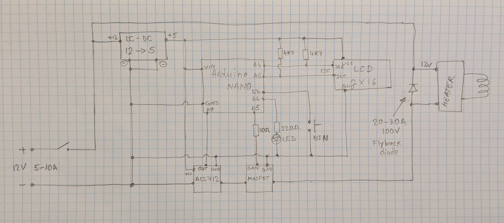

NOTE: This is a work in progress

## Required Components

Below is a list of components needed for this project:

- ~~ATTINY85 Development Board~~ (removed from project, not enough memory or pins)  
- **Arduino Nano or equivalent**  
- **I2C LCD 1602 Module (2x16)**  
- **MP1584EN DC to DC Buck Converter** (3A, 7V~28V to 5V)  
- **DC 5V-36V 15A (MAX 30A) 400W Dual High Power MOSFET Trigger Switch Drive Module**  
- **ACS712 Current Sensor (20A module)**  
- ~~MLX90614 Non-Contact Infrared Sensor~~ (I fried one, and then next two DOA)  
- **Momentary Push Button**  
- **DC 5V-12V ZVS DIY Low Voltage Induction Heating Module**  
- **LEDs**  
<!-- **Glass 14mm Female to 18mm Male Short Expander Adapter Connector**  -->

Total price as of January 2025, in Europe, is under **50€ (~$52).**  
Make sure to gather all these components before proceeding with the build.

---

### **MOSFET Upgrade Recommendation**
I recommend first replacing the N-channel MOSFETs on the ZVS induction module with better ones.

#### **Best Pick for Efficiency:**
- **IRLB3034PBF** – Lowest Rds(on), highest current handling, but more expensive.
- **IPB034N06N** – A good balance of low resistance and current capability.

#### **Best Pick for a Budget Build:**
- **IRLZ44N** or **IRF3205** – Widely available, still decent performance.

You can start using the coil with the original MOSFETs, but if they burn out, like mine did, replace them with one of the above options.

---

## **Schematic**

---

## **Demonstration Video**

---

## **Code**
You'll find the Arduino sketch [here](ihctrlnano/ihctrlnano.ino).

---

# **Description**
This sketch controls a coil (e.g., in an induction heating system) by 
monitoring current (via an ACS712 sensor) and metal presence. It offers two 
modes—**Manual and Auto**—selectable via a configuration menu displayed on a 
16×2 LCD. A single button navigates the menu and toggles the coil.

---

## **Operating Modes**

### **Manual Mode (Auto-Start OFF)**
- The coil remains off until toggled.
- Metal insertion does not auto-start the coil.
- A manual button push turns the coil ON/OFF.
- If the coil is ON and metal is removed, the coil shuts off.

### **Auto Mode (Auto-Start ON)**
- The system periodically pulses the coil to check for metal.
- Each pulse measures current via the ACS712 sensor.
- If current exceeds a set threshold, the coil turns ON.
- The coil remains on while metal is present.
- A button press while running forces a manual override.

---

## **Menu**
The LCD menu lets you configure:
- **Maximum On-Time** (in seconds)  
- **Auto-Start Mode** (ON/OFF)  

A long-press cycles through menu screens.  
A short press changes values.  

Settings are stored in EEPROM.
